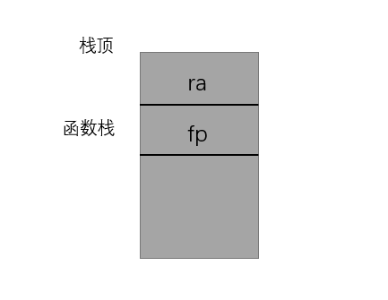
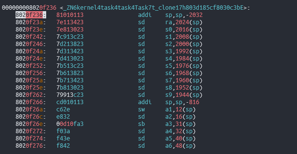

# Tracer

该工具是一个用于获取内核堆栈回溯信息的实用程序。它可以帮助您识别内核崩溃或故障的根本原因，从而更容易解决问题。

支持的语言: `Rust`

支持的架构:

- [x] `riscv`
- [ ] `loongarch`

支持的回溯方式:

- [x] 基于`fp`寄存器
- [x] 基于`eh_frame/eh_frame_hdr`段的`DWARF`
- [x] 基于指令信息

## 栈回溯分类

### 第一类

主要有两种堆栈回溯方式，一种是使用`sp`和`fp`指针进行回溯，如下图所示，在这种方式下，每当函数进行开辟栈帧操作后，就会保存`ra` `fp`的值，然后令`fp`指向当前的栈顶，



在这种情况下，在进行栈回溯时，首先根据`fp`寄存器指向的地址，取出保存在函数栈中`ra`和`fp`寄存器的数据,`ra`的值是函数返回地址，`fp`的值是上一级函数栈的栈顶地址,根据`ra`的值到收集的函数信息中查找此地址是否位于某个函数的范围，如果是，则记录函数信息，然后根据`fp`回到上一级函数，继续读取`ra`和`fp`的值，直到无法找到对应的函数区间。

### 第二类

第二种回溯方式是由于某些编译器为了优化代码并不会利用`fp`寄存器保存函数的调用栈，函数的调用栈信息被保存在一个`.eh_frame`段中。基于`fp`的方法存在以下问题:

1. 需要一个专门寄存器`fp`来保存frame poniter
2. 保存`fp`寄存器即保存回溯信息(unwind info)的动作会被编译成代码，有指令开销
3. 在回溯堆栈时，除了恢复sp，不知道怎么恢复其他的寄存器
4. 没有源语言信息

调试信息标准[DWARF(Debugging With Attributed Record Formats)](http://dwarfstd.org/doc/DWARF4.pdf)定义了一个`.debug_frame` section用来解决上述的难题。

1. 可以把`fp`当成常规寄存器使用
2. 不仅仅是用来恢复`fp`，还可以用来恢复其他寄存器
3. 不消耗任何指令周期，没有性能开销

但是这个`.debug_frame`仍然没有源语言信息并且不支持在程序加载时同时加载调试信息。现代Linux操作系统在[LSB(Linux Standard Base)](https://refspecs.linuxfoundation.org/LSB_5.0.0/LSB-Core-generic/LSB-Core-generic/ehframechpt.html)标准中定义了一个`.eh_frame` section来解决这个问题。

GAS(GCC Assembler)汇编编译器定义了一组伪指令来协助生成调用栈信息[CFI(Call Frame Information)](https://sourceware.org/binutils/docs-2.31/as/CFI-directives.html)。`CFI directives`伪指令是一组生成CFI调试信息的高级语言。

使用`readelf -wF xxx`命令可以elf文件中的`.eh_frame`解析后形成的一张表，这张表包含了如何恢复堆栈现场的信息。


## 栈回溯实现

根据栈回溯的分类，自然就形成了两种栈回溯的实现方式。但一般情况下，我们并不会生成`.eh_frame`段以及开启`fp`保存调用栈的功能，这导致无法使用上述两种方式进行回溯。

根据对`riscv`指令集以及汇编代码生成的观察，产生了第三种栈回溯实现，这种实现只需要代码段的信息就可以完成堆栈现场的恢复。我们首先描述这种实现。

对于几种实现，使用rust的trait系统来进行统一：

```rust
pub struct TraceInfo {
    pub func_name: &'static str,
    pub func_addr: usize,
    pub bias: usize,
}

pub trait Tracer {
    fn trace(&self) -> impl Iterator<Item = TraceInfo> + '_;
}

pub trait TracerProvider {
    fn address2symbol(&self, addr: usize) -> Option<(usize, &'static str)>;
}
```

- 三种方式都实现了`Tracer`这个接口
- 内核需要提供函数相关的信息


### 基于指令信息

根据一般函数生成形式，比如rust生成的一段`risc-v`代码如下

```
0000000080210412 <my_trace>:
    80210412:   7149                    addi    sp,sp,-368
    80210414:   f686                    sd      ra,360(sp)
    80210416:   f2a2                    sd      s0,352(sp)
    80210418:   eea6                    sd      s1,344(sp)
    8021041a:   eaca                    sd      s2,336(sp)
    8021041c:   e6ce                    sd      s3,328(sp)
    8021041e:   e2d2                    sd      s4,320(sp)
    80210420:   fe56                    sd      s5,312(sp)
    80210422:   fa5a                    sd      s6,304(sp
```

可以看到，函数的前两条指令是开辟栈空间和保存`ra`的指令，因此这里一个简单的想法就是通过读取函数的第一条指令和第二条指令，获取到开辟的栈空间大小以及`ra`存储的位置，这里`ra`一般就是存储在栈顶，读取第二条指令主要是确保这条指令是保存`ra`的指令。再使用汇编指令读取当前的`sp`值，就可以得到下面的回溯方式：

```
读取函数第一条指令和第二条指令获得栈大小size
栈底: sp
栈顶: sp + size
ra : m[sp+size-8]
寻找ra所在函数
将找到的函数设置为当前函数
再次重复上述过程
```

这种实现的主要工作在于如何解析函数的第一条和第二条指令，通过查询riscv手册可以找到各条指令的格式，比如`addi`指令的格式


读取第一条指令并按照上面的格式解析出立即数部分就可以得到栈大小，但由于risc-v的编译器会做某些优化，将`addi`指令使用压缩指令表示，而压缩指令一般是两字节格式，比如`c.addi`指令的格式如下:


因此需要根据压缩指令和未压缩的指令共同判断第一条指令是否未开辟栈空间的指令和栈空间大小。同理，判断第二条指令也需要如上的工作。

开辟栈空间用到的三条指令分别为(c开头的为压缩指令):

1. addi 
2. c.addi
3. c.addi16sp

保存`ra`的指令有两条分别为:

1. sd
2. c.sdsp
3. 

### 基于fp寄存器

这种方式比较简单，只要不断进行`fp`寄存器值恢复即可。使用伪代码表示其实现:

```
读取fp的值
ra :m[fp-8]
new_fp :m[fp-16]
fp = new_fp
```

### 基于CFI

使用CFI伪指令恢复堆栈现场，需要解析`.eh_frame`以及`.eh_frame_hdr`段信息，这可以使用`gimli`库完成。针对`riscv`，一个可能的`.eh_frame`格式化信息如下:

```shell
// riscv64-unknown-elf-readelf -wf 
00000000 0000000000000010 00000000 CIE
  Version:               1
  Augmentation:          "zR"
  Code alignment factor: 1
  Data alignment factor: -8
  Return address column: 1
  Augmentation data:     1b
  DW_CFA_def_cfa: r2 (sp) ofs 0

00000014 0000000000000018 00000018 FDE cie=00000000 pc=0000000080202810..0000000080202870
  DW_CFA_advance_loc: 2 to 0000000080202812
  DW_CFA_def_cfa_offset: 32
  DW_CFA_advance_loc: 6 to 0000000080202818
  DW_CFA_offset: r1 (ra) at cfa-8
  DW_CFA_offset: r8 (s0) at cfa-16
  DW_CFA_offset: r9 (s1) at cfa-24
  DW_CFA_nop
  
// riscv64-unknown-elf-readelf -wF
00000000 0000000000000010 00000000 CIE "zR" cf=1 df=-8 ra=1
   LOC           CFA      
0000000000000000 sp+0     

00000014 0000000000000018 00000018 FDE cie=00000000 pc=0000000080202810..0000000080202870
   LOC           CFA      ra    s0    s1    
0000000080202810 sp+0     u     u     u     
0000000080202812 sp+32    u     u     u     
0000000080202818 sp+32    c-8   c-16  c-24  
```

每个`.eh_frame` 段包含一个或多个`CFI`(Call Frame Information)记录，每条`CFI`记录包含一个`CIE`(Common Information Entry Record)记录，每个`CIE`包含一个或者多个`FDE`(Frame Description Entry)记录。这些条目的具体含义可以查看[官方文档](https://dwarfstd.org/doc/DWARF5.pdf) [Unwind 栈回溯详解_gcc unwind-CSDN博客](https://blog.csdn.net/pwl999/article/details/107569603)。

每条`FDE`中包含了`pc`的范围以及CFA的计算方式和ra的恢复方式。这个方法的伪代码说明如下:

```
获取当前的pc: auipc 
获取当前的sp
根据pc查找.eh_frame_hdr段找到.eh_frame段的CIE/FDE
根据CIE计算CFA的值
根据FDE计算sp,ra的值
new_pc = ra
new_sp = sp
再次查找循环
```


## 特殊情况及处理方法

### 多次使用addi sp, sp指令



在不使用`fp`寄存器的情况下，生成的代码中可能出现一个函数不止一次开辟栈空间的情况，如果使用基于CFI的方法，则不需要考虑这个问题，对于基于指令信息的方法，因为是读取指令获取函数开辟的栈空间的大小，因此就不能直接认为只有函数的第一条指令才会开辟栈空间，这里的解决方法是：

检查函数开始位置到`ra`之间的所有指令，记录所有开辟栈空间的指令，计算总的栈空间大小。

由于这些指令存在压缩指令，因此不能每次都读取四字节大小来检查，相反，我们观察到`addi`指令开辟栈空间时，其低16位的值固定为0x113,另外两条压缩指令开辟栈空间时固定位置也有固定值，因此检查的方法就是每次读取2字节的指令：

1. 检查值是否为0x113,如果是，重新读取4字节，检查是否是开辟栈空间指令(立即数<0)
2. 检查是否是另外两条压缩指令，如果是，检查是否是开辟栈空间指令(立即数<0)

这样一来，就可以正确计算一个函数开辟的栈空间大小，从而完成正确的回溯。


## How To Use

1. 内核需要实现`TracerProvider` trait以提供符号信息查询，通常内核需要判断这个地址是否位于两个函数的地址区间中

2. 选择合适的`Tracer`实现

   1. 如果内核开启了`force-frame-pointers=yes`, 则使用基于fp寄存器的`FramePointTracer`

   2. 如果内核开启了

      ```
      "-C", "force-unwind-tables=yes",
      "-C", "link-args=--eh-frame-hdr",
      ```

      则使用基于CFI的`DwarfTracer`

3. 如果上述两者都没有，则使用`CompilerTracer`


## 如何获取内核符号信息

内核提供符号信息有多种方式:

1. 将内核符号信息保存到文件中，保存到磁盘上，内核崩溃时从磁盘读取
2. 将符号信息一起同内核编译，崩溃时从内存中直接读取

第一种方式可能会造成读取磁盘时再次崩溃，在不能保证读取磁盘正确的情况下更推荐第二种方式，直接从内存查找可以避免内存分配，降低崩溃的概率。

这篇文章概述了一种保存内核符号信息的方式[获取内核符号信息](./usage.md) ，可配合本工具一起使用。

## Example

```rust
struct TracerProviderImpl;
impl TracerProvider for TracerProviderImpl{
    fn address2symbol(&self, addr: usize) -> Option<(usize, &'static str)> {
        warn!("address2symbol: {:#x}",addr);
        find_symbol_with_addr(addr)
    }
}

fn back_trace() {
    println!("---START BACKTRACE---");
    let tracer = CompilerTracer::new(TracerProviderImpl);
    // let tracer = FramePointTracer::new(TracerProviderImpl);
    // let tracer = DwarfTracer::new(DwarfProviderImpl,TracerProviderImpl);
    for x in tracer.trace(){
        println!("[{:#x}] (+{:0>4x}) {}",x.func_addr,x.bias,x.func_name);
    }
    println!("---END   BACKTRACE---");
}
```

```
[0] ---START BACKTRACE---
[0] [0x80229fc2] (+0260) rust_begin_unwind
[0] [0x802bbd20] (+002c) core::panicking::panic_fmt
[0] [0x8020e57a] (+05b0) kernel::task::task::Task::t_clone
[0] [0x802620a2] (+00d6) kernel::task::cpu::clone
[0] [0x802320b2] (+0026) __clone
[0] [0x80217f98] (+03b2) kernel::trap::exception::syscall_exception_handler
[0] [0x8022f414] (+03de) <riscv::register::scause::Trap as kernel::trap::TrapHandler>::do_user_handle
[0] ---END   BACKTRACE---
```


## TODO

- [ ] 在`dwarf`中禁用alloc，避免alloc错误造成再次panic


## 参考资料

https://blog.csdn.net/pwl999/article/details/107569603
https://doc.rust-lang.org/rustc/codegen-options/index.html

[Unwinding the stack the hard way • lesenechal.fr](https://lesenechal.fr/en/linux/unwinding-the-stack-the-hard-way)

[DWARF Debugging Information Format Version 5 (dwarfstd.org)](https://dwarfstd.org/doc/DWARF5.pdf)

[linux 栈回溯(x86_64 ) - 知乎 (zhihu.com)](https://zhuanlan.zhihu.com/p/302726082)

[RISC-V 编程之 Frame Pointer和 backtrace_riscv backtrace_半斗米的博客-CSDN博客](https://blog.csdn.net/zoomdy/article/details/123140219)

[Airs – Ian Lance Taylor » .eh_frame_hdr](https://www.airs.com/blog/archives/462)

